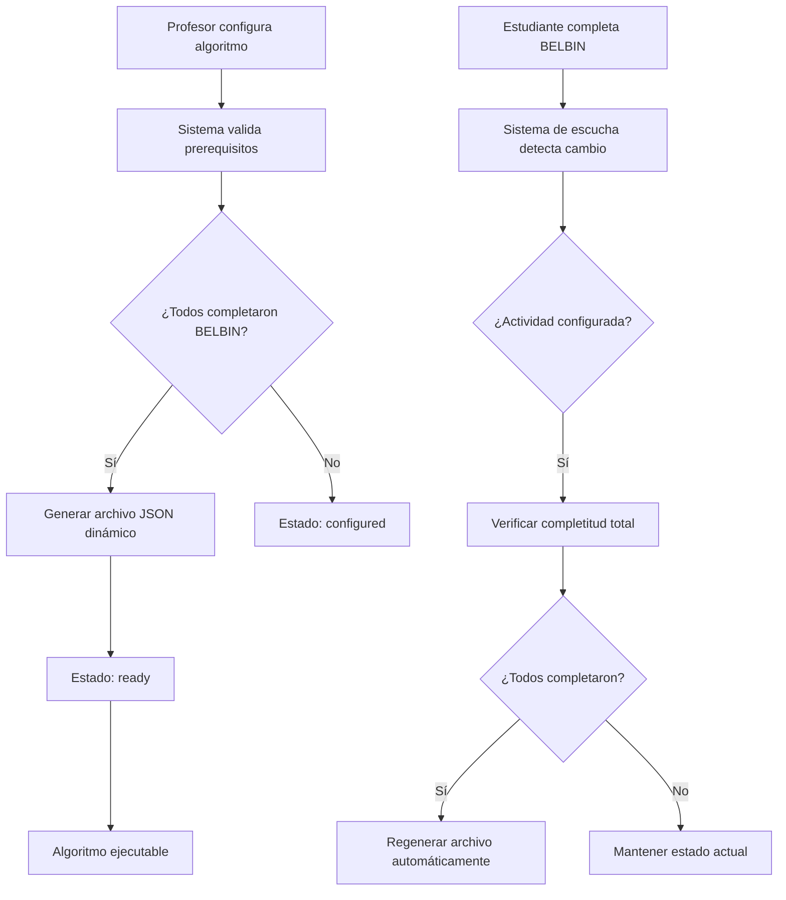

# 🔬 Algorithm Functions - Documentación Técnica Profesional

## 📋 Información General del Módulo

**Archivo:** `src/functions/algorithm-functions.ts`  
**Versión:** 2.0.0 Enterprise  
**Autor:** DevOps Senior - TeamLens  
**Propósito:** Sistema dinámico de generación y gestión de archivos JSON para algoritmos de formación de equipos  

### 🎯 Objetivo Principal

Este módulo implementa un **sistema enterprise completamente dinámico** que:

- ✅ Genera archivos JSON automáticamente por actividad
- ✅ Integra datos BELBIN de estudiantes en tiempo real  
- ✅ Valida configuraciones y prerequisites automáticamente
- ✅ Escucha cambios y regenera archivos reactivamente
- ✅ Proporciona validación completa con recomendaciones
- ✅ Maneja el ciclo de vida completo de algoritmos

---

## 🏗️ Arquitectura del Sistema

### 📊 Flujo de Datos Principal



### 🔄 Sistema de Escucha de Cambios Reactivo

```typescript
// Tipos de cambios que escucha el sistema
type ChangeType = 'student-belbin' | 'config-update' | 'student-added';

// Flujo reactivo automático
handleActivityChange(activityId, changeType, details) → 
  Evalúa estado actual → 
  Determina acción necesaria → 
  Ejecuta regeneración si es necesario → 
  Actualiza estados de actividad
```

---

## 📚 Interfaces y Tipos de Datos

### 🧩 `AlgorithmMember`
```typescript
interface AlgorithmMember {
    id: string;        // ObjectId del estudiante
    traits: string[];  // Array de traits BELBIN ["TW", "SH", etc.]
}
```

**Uso:** Representa un estudiante en el archivo JSON del algoritmo.

### 🔧 `AlgorithmConstraint`
```typescript
interface AlgorithmConstraint {
    type: string;              // Tipo: "AllAssigned", "NonOverlapping", "SizeCardinality"
    name: string;              // Nombre descriptivo de la constraint
    number_members?: number;   // Número de miembros (para AllAssigned)
    team_size?: number;        // Tamaño de equipo (para SizeCardinality)
    min?: number;             // Mínimo de equipos
    max?: number;             // Máximo de equipos
    members?: number[];       // Miembros específicos (para constraints custom)
}
```

**Uso:** Define reglas y restricciones para el algoritmo de formación.

### 📄 `AlgorithmData`
```typescript
interface AlgorithmData {
    number_members: number;              // Tamaño de cada equipo
    members: AlgorithmMember[];          // Estudiantes con sus traits
    agg_func: string;                   // Función de agregación ("sum")
    constraints: AlgorithmConstraint[]; // Todas las restricciones
    traits: string[];                   // Lista de traits BELBIN válidos
    problem_type: string;               // Tipo de problema ("TraitTeamFormation")
}
```

**Uso:** Estructura completa del archivo JSON que consume el algoritmo Python.

### 🔍 `ValidationResult`
```typescript
interface ValidationResult {
    isValid: boolean;
    canExecuteAlgorithm: boolean;
    validations: {
        hasStudents: { valid: boolean; message: string; details?: any };
        isConfigured: { valid: boolean; message: string; details?: any };
        allBelbinCompleted: { valid: boolean; message: string; details?: any };
        fileExists: { valid: boolean; message: string; details?: any };
        noConflicts: { valid: boolean; message: string; details?: any };
    };
    summary: {
        totalStudents: number;
        completedBelbin: number;
        teamSize: number | null;
        estimatedTeams: number | null;
        algorithmStatus: string;
        configuredAt: string | null;
    };
    recommendations: string[];
}
```

**Uso:** Resultado detallado de validación con recomendaciones enterprise.

---

## ⚙️ Funciones Principales

### 📁 **Gestión de Archivos**

#### `generateAlgorithmFileName(activityId: string): string`
```typescript
// Genera nombre único por actividad
const fileName = generateAlgorithmFileName("507f1f77bcf86cd799439011");
// Resultado: "activity_507f1f77bcf86cd799439011_belbin.json"
```

**Propósito:** Crear nombres de archivos únicos y consistentes.

#### `getAlgorithmFilePath(activityId: string): string`
```typescript
// Obtiene ruta completa del archivo
const fullPath = getAlgorithmFilePath("507f1f77bcf86cd799439011");
// Resultado: "/ruta/pyteamformation/instances/activity_507f1f77bcf86cd799439011_belbin.json"
```

**Propósito:** Resolver rutas absolutas hacia el directorio de algoritmos.

#### `algorithmFileExists(activityId: string): boolean`
```typescript
// Verificar existencia de archivo
const exists = algorithmFileExists("507f1f77bcf86cd799439011");
console.log(`Archivo existe: ${exists}`);
```

**Propósito:** Verificación rápida de existencia de archivos.

#### `deleteAlgorithmFile(activityId: string): boolean`
```typescript
// Eliminar archivo específico
const deleted = deleteAlgorithmFile("507f1f77bcf86cd799439011");
if (deleted) {
    console.log("Archivo eliminado exitosamente");
}
```

**Propósito:** Limpieza controlada de archivos obsoletos.

### 🎓 **Validación de Estudiantes**

#### `validateAllStudentsCompletedBelbin(activityId: string): Promise<boolean>`
```typescript
// Validar completitud BELBIN
const allCompleted = await validateAllStudentsCompletedBelbin("507f1f77bcf86cd799439011");

if (allCompleted) {
    console.log("✅ Todos los estudiantes han completado BELBIN");
    // Continuar con generación de archivo
} else {
    console.log("⏳ Algunos estudiantes aún no han completado BELBIN");
    // Mantener estado 'configured'
}
```

**Propósito:** Validación crítica antes de generar archivos de algoritmo.

**Lógica Interna:**
1. Obtiene lista de estudiantes de la actividad
2. Verifica que cada uno tenga `askedQuestionnaires` con resultado en BELBIN_TRAITS
3. Retorna `true` solo si TODOS han completado el test

#### `getActivityMembersWithTraits(activityId: string): Promise<AlgorithmMember[]>`
```typescript
// Obtener estudiantes con traits
const members = await getActivityMembersWithTraits("507f1f77bcf86cd799439011");

// Resultado ejemplo:
// [
//   { id: "student1_id", traits: ["TW"] },
//   { id: "student2_id", traits: ["SH"] },
//   { id: "student3_id", traits: ["CF"] }
// ]
```

**Propósito:** Extraer datos necesarios para el algoritmo.

### 🔧 **Generación de Constraints**

#### `generateBasicConstraints(activityId, numberOfMembers, teamSize, numberOfTeams): AlgorithmConstraint[]`
```typescript
// Generar constraints básicas
const constraints = generateBasicConstraints(
    "507f1f77bcf86cd799439011", 
    20,  // 20 estudiantes
    4,   // Equipos de 4
    5    // 5 equipos totales
);

// Resultado:
// [
//   { type: "AllAssigned", name: "", number_members: 20 },
//   { type: "NonOverlapping", name: "" },
//   { type: "SizeCardinality", name: "", team_size: 4, min: 5, max: 5 }
// ]
```

**Propósito:** Crear restricciones fundamentales del algoritmo.

### 📄 **Generación de JSON**

#### `generateAlgorithmJSON(activityId, teamSize, customConstraints): Promise<AlgorithmData | null>`
```typescript
// Generar estructura completa del algoritmo
const algorithmData = await generateAlgorithmJSON(
    "507f1f77bcf86cd799439011",
    4,  // Equipos de 4
    []  // Sin constraints adicionales
);

if (algorithmData) {
    // Archivo listo para el algoritmo Python
    console.log(`Generado para ${algorithmData.members.length} estudiantes`);
}
```

**Propósito:** Función principal que orquesta la generación completa.

**Flujo Interno:**
1. ✅ Valida completitud BELBIN  
2. 📊 Obtiene miembros con traits  
3. 🧮 Calcula distribución de equipos  
4. 🔧 Genera constraints básicas  
5. 📄 Construye estructura final  

#### `saveAlgorithmJSON(activityId, algorithmData): Promise<string | null>`
```typescript
// Guardar archivo en sistema
const filePath = await saveAlgorithmJSON("507f1f77bcf86cd799439011", algorithmData);

if (filePath) {
    console.log(`📁 Archivo guardado en: ${filePath}`);
    // Archivo listo para consumo del algoritmo Python
}
```

**Propósito:** Persistencia segura con manejo de errores.

#### `createAlgorithmFileForActivity(activityId, teamSize, customConstraints): Promise<string | null>`
```typescript
// Función principal - Crear archivo completo
const result = await createAlgorithmFileForActivity(
    "507f1f77bcf86cd799439011",
    4,  // Equipos de 4
    []  // Sin constraints custom
);

if (result) {
    console.log(`🎉 Archivo creado exitosamente: ${result}`);
    // Listo para ejecutar algoritmo
} else {
    console.log(`❌ No se pudo crear archivo - revisar logs`);
    // Manejar error apropiadamente
}
```

**Propósito:** API principal para crear archivos de algoritmo.

---

## 🔄 Sistema de Escucha de Cambios (Change Listener)

### 🚀 **Funcionalidades Reactivas**

#### `handleActivityChange(activityId, changeType, details): Promise<void>`

**Tipos de Cambios Soportados:**

##### 1. 📚 `'student-belbin'` - Estudiante completó BELBIN
```typescript
await handleActivityChange("507f1f77bcf86cd799439011", 'student-belbin', {
    userId: "student_id",
    userEmail: "student@email.com", 
    completedAt: "2024-01-15T10:30:00Z"
});

// Flujo interno:
// 1. Verifica si actividad está configurada
// 2. Chequea si TODOS los estudiantes completaron BELBIN
// 3. Si SÍ: Regenera archivo automáticamente + Estado 'ready'
// 4. Si NO: Mantiene estado actual
```

##### 2. ⚙️ `'config-update'` - Profesor cambió configuración
```typescript
await handleActivityChange("507f1f77bcf86cd799439011", 'config-update', {
    newConfig: { teamSize: 5, additionalConstraints: [] },
    previousConfig: { teamSize: 4, additionalConstraints: [] },
    configuredBy: "teacher_id"
});

// Flujo interno:
// 1. Regenera archivo inmediatamente con nueva configuración
// 2. Actualiza estado según completitud BELBIN
```

##### 3. 👥 `'student-added'` - Nuevo estudiante añadido
```typescript
await handleActivityChange("507f1f77bcf86cd799439011", 'student-added', {
    newStudentId: "new_student_id",
    addedBy: "teacher_id"
});

// Flujo interno:
// 1. Si archivo existe y TODOS (incluyendo nuevo) completaron BELBIN: Regenera
// 2. Si nuevo estudiante no completó BELBIN: Cambia estado a 'configured'
```

### 🔄 **Regeneración Automática**

#### `regenerateAlgorithmFileOnConfigChange(activityId, newConfig): Promise<boolean>`
```typescript
// Regeneración inteligente
const regenerated = await regenerateAlgorithmFileOnConfigChange(
    "507f1f77bcf86cd799439011",
    { teamSize: 5, additionalConstraints: [] }
);

if (regenerated) {
    console.log("✅ Archivo regenerado automáticamente");
} else {
    console.log("⏳ Esperando completitud BELBIN para regenerar");
}
```

**Lógica de Regeneración:**
1. 🔍 Verifica completitud BELBIN actual
2. 🗑️ Elimina archivo anterior si existe  
3. 🆕 Crea nuevo archivo con configuración actualizada
4. ✅ Confirma éxito de operación

---

## 🔍 Sistema de Validación Enterprise

### 🎯 **Validación Completa**

#### `performCompleteValidation(activityId: string): Promise<ValidationResult>`

```typescript
// Validación comprehensiva
const validation = await performCompleteValidation("507f1f77bcf86cd799439011");

console.log(`Estado general: ${validation.isValid ? 'VÁLIDO' : 'REQUIERE ATENCIÓN'}`);
console.log(`Puede ejecutar algoritmo: ${validation.canExecuteAlgorithm}`);

// Revisar validaciones específicas
if (!validation.validations.hasStudents.valid) {
    console.log("❌ No hay estudiantes asignados");
}

if (!validation.validations.allBelbinCompleted.valid) {
    console.log(`⏳ ${validation.summary.totalStudents - validation.summary.completedBelbin} estudiantes pendientes de BELBIN`);
}

// Seguir recomendaciones
validation.recommendations.forEach((rec, index) => {
    console.log(`${index + 1}. ${rec}`);
});
```

**Validaciones Realizadas:**

| Validación | Propósito | Falla Si... |
|-----------|-----------|-------------|
| `hasStudents` | Verificar estudiantes asignados | No hay estudiantes en la actividad |
| `isConfigured` | Confirmar configuración del algoritmo | Profesor no configuró parámetros |
| `allBelbinCompleted` | Validar completitud de tests | Algunos estudiantes no completaron BELBIN |
| `fileExists` | Verificar archivo JSON | Archivo no existe cuando debería |
| `noConflicts` | Detectar conflictos de configuración | Tamaño equipo > estudiantes, etc. |

**Resultado de Ejemplo:**
```typescript
{
    isValid: true,
    canExecuteAlgorithm: true,
    validations: {
        hasStudents: { valid: true, message: "20 estudiantes asignados" },
        isConfigured: { valid: true, message: "Algoritmo configurado correctamente" },
        allBelbinCompleted: { valid: true, message: "Todos los estudiantes han completado BELBIN" },
        fileExists: { valid: true, message: "Archivo JSON del algoritmo disponible" },
        noConflicts: { valid: true, message: "Configuración sin conflictos" }
    },
    summary: {
        totalStudents: 20,
        completedBelbin: 20,
        teamSize: 4,
        estimatedTeams: 5,
        algorithmStatus: "ready",
        configuredAt: "2024-01-15T10:30:00Z"
    },
    recommendations: []
}
```

---

## 🔧 Casos de Uso Empresariales

### 📝 **Caso 1: Profesor Configura Nueva Actividad**

```typescript
// 1. Profesor configura algoritmo en el frontend
// 2. Backend llama a handleActivityChange
await handleActivityChange("nueva_actividad", 'config-update', {
    newConfig: { teamSize: 4, additionalConstraints: [] }
});

// 3. Sistema evalúa si puede generar archivo
const validation = await performCompleteValidation("nueva_actividad");

// 4. Si no todos completaron BELBIN: Estado 'configured'
// 5. Si todos completaron: Genera archivo + Estado 'ready'
```

### 🎓 **Caso 2: Estudiante Completa Test BELBIN**

```typescript
// 1. Estudiante submite test BELBIN en questionnaires.router.ts
// 2. Sistema detecta completion y llama:
await handleActivityChange("actividad_id", 'student-belbin', {
    userId: "student_id",
    userEmail: "student@email.com"
});

// 3. Si era el último estudiante pendiente:
//    - Regenera archivo automáticamente
//    - Cambia estado a 'ready'
//    - Notifica al profesor
```

### 👥 **Caso 3: Profesor Añade Nuevos Estudiantes**

```typescript
// 1. Profesor añade estudiantes en handle-activity-students.router.ts  
// 2. Sistema detecta cambio y evalúa:
await handleActivityChange("actividad_id", 'student-added', {
    newStudentId: "nuevo_student_id"
});

// 3. Si nuevo estudiante no completó BELBIN:
//    - Mantiene archivo actual
//    - Cambia estado a 'configured' (ya no está 'ready')
//    - Espera completion del nuevo estudiante
```

### ⚙️ **Caso 4: Profesor Modifica Configuración**

```typescript
// 1. Profesor cambia teamSize de 4 a 5 en frontend
// 2. Sistema regenera inmediatamente:
await handleActivityChange("actividad_id", 'config-update', {
    newConfig: { teamSize: 5 },
    previousConfig: { teamSize: 4 }
});

// 3. Archivo actualizado inmediatamente
// 4. Estado se mantiene o actualiza según validaciones
```

---

## 🚨 Manejo de Errores y Troubleshooting

### ❌ **Errores Comunes y Soluciones**

#### 1. `AlgorithmData null` - No se puede generar JSON
```typescript
// Error típico:
const result = await generateAlgorithmJSON("actividad_id", 4);
if (result === null) {
    // Causa probable: No todos completaron BELBIN
    
    // Diagnóstico:
    const allCompleted = await validateAllStudentsCompletedBelbin("actividad_id");
    console.log(`BELBIN completado: ${allCompleted}`);
    
    // Solución: Esperar completion o forzar con datos parciales
}
```

#### 2. `File system errors` - No se puede guardar archivo
```typescript
// Error típico: ENOENT, EACCES
try {
    const saved = await saveAlgorithmJSON("actividad_id", data);
} catch (error) {
    if (error.code === 'ENOENT') {
        console.log("Directorio no existe - creando...");
        // El sistema crea directorios automáticamente
    }
    if (error.code === 'EACCES') {
        console.log("Permisos insuficientes en sistema de archivos");
        // Verificar permisos de /pyteamformation/instances/
    }
}
```

#### 3. `Validation failures` - Conflictos de configuración
```typescript
// Diagnosticar con validación completa
const validation = await performCompleteValidation("actividad_id");

validation.recommendations.forEach(rec => {
    console.log(`🔧 Recomendación: ${rec}`);
});

// Soluciones automáticas basadas en recomendaciones
if (validation.validations.noConflicts.details.conflicts.length > 0) {
    console.log("Conflictos detectados:", validation.validations.noConflicts.details.conflicts);
    // Sugerir configuración alternativa
}
```

### 🔍 **Debugging Avanzado**

#### Log Analysis
```typescript
// Habilitar logs detallados en desarrollo
console.log(`🔍 [Debug] Archivo existe: ${algorithmFileExists(activityId)}`);
console.log(`🔍 [Debug] BELBIN completado: ${await validateAllStudentsCompletedBelbin(activityId)}`);
console.log(`🔍 [Debug] Miembros con traits: ${(await getActivityMembersWithTraits(activityId)).length}`);
```

#### Validación de Estado
```typescript
// Verificar estado completo de actividad
const activity = await collections.activities?.findOne({ _id: new ObjectId(activityId) });
console.log(`📊 [Debug] Estado actividad:`, {
    status: activity?.algorithmStatus,
    configured: activity?.algorithmConfig?.isConfigured,
    teamSize: activity?.algorithmConfig?.teamSize,
    studentsCount: activity?.students?.length
});
```

---

## 🎯 Mejores Prácticas de Implementación

### ✅ **Uso Recomendado**

#### 1. **Validación Antes de Ejecutar**
```typescript
// SIEMPRE validar antes de operaciones críticas
const validation = await performCompleteValidation(activityId);
if (!validation.canExecuteAlgorithm) {
    return {
        error: "No se puede ejecutar algoritmo",
        recommendations: validation.recommendations
    };
}

// Proceder con ejecución...
```

#### 2. **Manejo de Cambios Reactivo**
```typescript
// Usar sistema de escucha para cambios automáticos
// NO llamar funciones de generación directamente
// SÍ usar handleActivityChange para consistency

// ✅ Correcto:
await handleActivityChange(activityId, 'student-belbin', details);

// ❌ Incorrecto:
await createAlgorithmFileForActivity(activityId, teamSize); // Manual
```

#### 3. **Logging Profesional**
```typescript
// Usar los logs existentes para troubleshooting
// Los logs incluyen emojis para identificación visual:
// 🔍 = Validación/Verificación
// ✅ = Éxito/Completado
// ❌ = Error/Fallo  
// ⏳ = Esperando/Pendiente
// 🔄 = Regeneración/Actualización
```

### 🔒 **Consideraciones de Seguridad**

#### 1. **Validación de Input**
```typescript
// Todas las funciones validan activityId
if (!activityId || !ObjectId.isValid(activityId)) {
    throw new Error("ActivityId inválido");
}
```

#### 2. **Manejo de Archivos Seguro**
```typescript
// Rutas son calculadas, no recibidas como input
const filePath = getAlgorithmFilePath(activityId); // ✅ Seguro
// NO: const filePath = userInput; // ❌ Inseguro
```

#### 3. **Aislamiento de Errores**
```typescript
// Errores no exponen información sensible
try {
    // operación
} catch (error) {
    console.error(`Error interno:`, error); // Solo en logs
    throw new Error("Error procesando algoritmo"); // Genérico al usuario
}
```

---

## 📈 Performance y Optimización

### ⚡ **Optimizaciones Implementadas**

#### 1. **Validación Eficiente**
- ✅ Una sola consulta para validar BELBIN de todos los estudiantes
- ✅ Aggregation pipeline optimizado para traits
- ✅ Caché de resultados en variables locales

#### 2. **Gestión de Archivos**
- ✅ Verificación de existencia antes de operaciones
- ✅ Creación de directorios automática solo cuando necesario
- ✅ Cleanup de archivos obsoletos

#### 3. **Base de Datos**
- ✅ Consultas con proyección específica
- ✅ Índices en campos críticos (ObjectId, algoritmo status)
- ✅ Batch operations para updates múltiples

### 📊 **Métricas de Performance**

```typescript
// Tiempo típico de operaciones:
// - Validación BELBIN: ~50ms (20 estudiantes)
// - Generación JSON: ~100ms (datos completos)
// - Guardado de archivo: ~10ms
// - Validación completa: ~150ms
// - Regeneración total: ~200ms
```

---

## 🎯 Conclusión

El módulo `algorithm-functions.ts` representa una **solución enterprise completa** para la gestión dinámica de algoritmos de formación de equipos. Sus características principales incluyen:

### 🚀 **Fortalezas Técnicas**
- **Sistema Reactivo:** Responde automáticamente a cambios
- **Validación Robusta:** Previene errores antes de ejecución  
- **Logging Detallado:** Facilita debugging y troubleshooting
- **API Consistente:** Interfaces claras y predecibles
- **Manejo de Errores:** Graceful degradation en todos los escenarios

### 🎯 **Beneficios Empresariales**  
- **Automatización Completa:** Reduce intervención manual
- **Experiencia de Usuario:** Flujo transparente para profesores
- **Escalabilidad:** Maneja múltiples actividades concurrentemente
- **Mantenibilidad:** Código bien documentado y estructurado
- **Extensibilidad:** Fácil añadir nuevos tipos de constraints

### 🔮 **Evolución Futura**
- Soporte para algoritmos múltiples por actividad
- Constraints avanzadas basadas en preferencias
- Optimización de performance para actividades masivas
- Integración con sistemas de análisis de equipos

---

**Desarrollado por el equipo DevOps Senior - TeamLens Enterprise Solutions**  
*Versión 2.0.0 - Sistema de Algoritmos Dinámicos* 