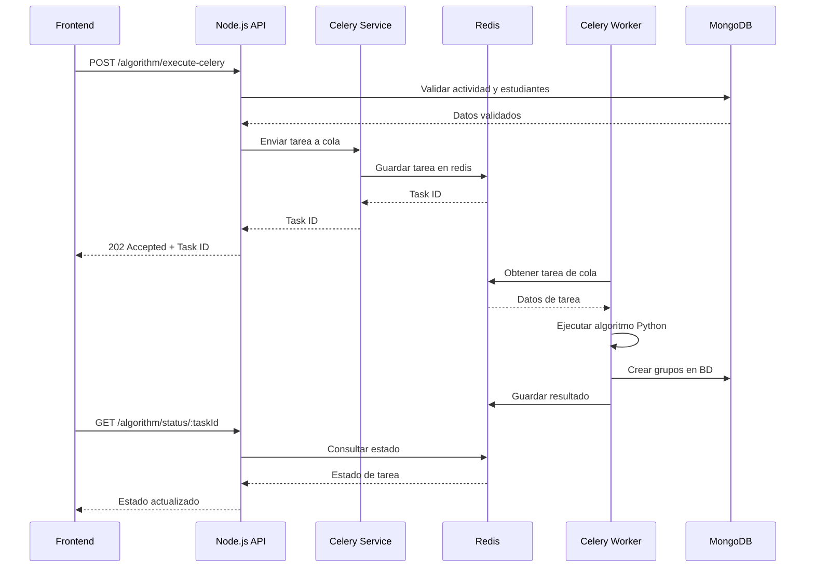

# ============================================================================
# TeamLens Backend - Sistema de Colas Distribuido con Celery
# Documentación Técnica Completa para el Equipo de Desarrollo
# ============================================================================

## 📋 Tabla de Contenidos

1. [Introducción](#introducción)
2. [Arquitectura del Sistema](#arquitectura-del-sistema)
3. [Instalación y Configuración](#instalación-y-configuración)
4. [Configuración de Desarrollo](#configuración-de-desarrollo)
5. [Configuración de Producción AWS](#configuración-de-producción-aws)
6. [API y Endpoints](#api-y-endpoints)
7. [Monitoreo y Observabilidad](#monitoreo-y-observabilidad)
8. [Troubleshooting](#troubleshooting)
9. [Mejores Prácticas](#mejores-prácticas)
10. [Roadmap y Próximas Mejoras](#roadmap-y-próximas-mejoras)

---

## 🚀 Introducción

Este documento describe la implementación completa del **Sistema de Colas Distribuido** para TeamLens, diseñado para manejar la ejecución asíncrona del algoritmo de formación de grupos de manera escalable y robusta en AWS.

### 🎯 Objetivos del Sistema

- **Escalabilidad**: Manejo de múltiples solicitudes simultáneas de algoritmos
- **Confiabilidad**: Tolerancia a fallos y recuperación automática
- **Observabilidad**: Monitoreo en tiempo real y métricas detalladas
- **Rendimiento**: Optimización para cargas de trabajo computacionalmente intensivas
- **Mantenibilidad**: Código bien documentado y fácil de mantener

### 🔧 Tecnologías Utilizadas

- **Celery 5.3+**: Sistema de colas distribuido
- **Redis 7.2+**: Message broker y result backend
- **Flower 2.0+**: Monitoreo en tiempo real
- **Node.js/TypeScript**: Integración con backend existente
- **AWS ECS + Fargate**: Contenedores sin servidor
- **AWS ElastiCache**: Redis gestionado
- **Terraform**: Infrastructure as Code

---

## 🏗️ Arquitectura del Sistema

### Diagrama de Arquitectura

```
┌─────────────────┐    ┌─────────────────┐    ┌─────────────────┐
│   Frontend      │    │   Node.js API   │    │   Celery        │
│   Angular       │────│   Express       │────│   Workers       │
└─────────────────┘    └─────────────────┘    └─────────────────┘
                                │                        │
                                │                        │
                       ┌─────────────────┐    ┌─────────────────┐
                       │   MongoDB       │    │   Redis         │
                       │   (Database)    │    │   (Message      │
                       │                 │    │    Broker)      │
                       └─────────────────┘    └─────────────────┘
                                                        │
                                                ┌─────────────────┐
                                                │   Flower        │
                                                │   (Monitoring)  │
                                                └─────────────────┘
```

### Componentes Principales

#### 1. **Node.js API Server**
- **Archivo**: `src/routes/activity.router.celery.ts`
- **Responsabilidad**: Recibir peticiones HTTP y enviar tareas a Celery
- **Puerto**: 3000
- **Endpoints principales**:
  - `POST /activities/:id/algorithm/execute-celery`
  - `GET /activities/:id/algorithm/status/:taskId`
  - `POST /activities/:id/algorithm/cancel/:taskId`

#### 2. **Celery Workers**
- **Archivo**: `src/tasks/algorithm_tasks.py`
- **Responsabilidad**: Ejecutar algoritmos de formación de grupos
- **Tipos de workers**:
  - **Algorithm Worker**: Procesa algoritmos (alta prioridad)
  - **Validation Worker**: Valida prerrequisitos
  - **Cleanup Worker**: Limpia recursos (baja prioridad)

#### 3. **Redis Message Broker**
- **Responsabilidad**: Gestión de colas y resultados
- **Configuración**: 16 bases de datos
  - DB 0: Mensajes de Celery
  - DB 1: Resultados de tareas
  - DB 2-15: Reservadas para futuro uso

#### 4. **Flower Monitoring**
- **Puerto**: 5555
- **URL**: http://localhost:5555
- **Responsabilidad**: Monitoreo en tiempo real de workers y tareas

### Flujo de Ejecución



---

## ⚙️ Instalación y Configuración

### Prerrequisitos

- **Python 3.8+**
- **Node.js 16+**
- **Docker** (recomendado para Redis)
- **Git**

### 🚀 Instalación Automática

```bash
# Clonar repositorio
git clone <repository-url>
cd teamlens/backend_teamlens

# Ejecutar script de configuración automática
chmod +x scripts/setup_celery_system.sh
./scripts/setup_celery_system.sh
```

### 📋 Instalación Manual

#### 1. Configurar Python y dependencias

```bash
# Crear entorno virtual
python3 -m venv venv
source venv/bin/activate  # Linux/Mac
# o
venv\Scripts\activate  # Windows

# Instalar dependencias
pip install -r requirements.txt
```

#### 2. Configurar Redis con Docker

```bash
# Iniciar Redis
docker-compose -f docker-compose.redis.yml up -d redis

# Verificar que Redis está funcionando
docker exec teamlens_redis redis-cli ping
```

#### 3. Configurar variables de entorno

```bash
# Copiar archivo de ejemplo
cp .env.example .env

# Editar configuración
nano .env
```

#### 4. Configurar Node.js

```bash
# Instalar dependencias adicionales
npm install ioredis uuid @types/uuid @types/ioredis
```

---

## 🔧 Configuración de Desarrollo

### Archivo `.env` para Desarrollo

```bash
# Configuración básica
NODE_ENV=development
PORT=3000

# Redis local
REDIS_URL=redis://:password@localhost:6379/0
REDIS_RESULT_BACKEND=redis://:password@localhost:6379/1

# MongoDB local
MONGODB_URI=mongodb://localhost:27017/test

# Configuración de Celery
CELERY_LOG_LEVEL=INFO
CELERY_WORKER_CONCURRENCY=4

# Flower monitoring
FLOWER_BASIC_AUTH=admin:flower123
```

### Iniciar Sistema en Desarrollo

```bash
# Terminal 1: Iniciar Redis
docker-compose -f docker-compose.redis.yml up -d

# Terminal 2: Iniciar Celery Workers
./scripts/start_celery_worker.sh start 3

# Terminal 3: Iniciar Node.js API
npm run dev

# Terminal 4: Iniciar Flower (opcional)
docker-compose -f docker-compose.redis.yml up -d flower
```

### URLs de Desarrollo

- **API Backend**: http://localhost:3000
- **Flower Monitoring**: http://localhost:5555
- **Redis Commander**: http://localhost:8081

---

## ☁️ Configuración de Producción AWS

### Arquitectura AWS

```
┌─────────────────────────────────────────────────────────────┐
│                        AWS Cloud                           │
│                                                             │
│  ┌─────────────────┐  ┌─────────────────┐  ┌─────────────┐ │
│  │   Application   │  │   ElastiCache   │  │  CloudWatch │ │
│  │   Load Balancer │  │   Redis Cluster │  │   Logs      │ │
│  └─────────────────┘  └─────────────────┘  └─────────────┘ │
│           │                     │                  │       │
│  ┌─────────────────┐  ┌─────────────────┐  ┌─────────────┐ │
│  │   ECS Fargate   │  │   Secrets       │  │  Auto       │ │
│  │   Celery        │  │   Manager       │  │  Scaling    │ │
│  │   Workers       │  │                 │  │             │ │
│  └─────────────────┘  └─────────────────┘  └─────────────┘ │
└─────────────────────────────────────────────────────────────┘
```

### Despliegue con Terraform

```bash
# Navegar a configuración de Terraform
cd aws/terraform

# Inicializar Terraform
terraform init

# Planificar despliegue
terraform plan -var="environment=prod"

# Aplicar configuración
terraform apply -var="environment=prod"
```

### Variables de Terraform

```hcl
variable "environment" {
  description = "Entorno de despliegue"
  type        = string
  default     = "prod"
}

variable "redis_node_type" {
  description = "Tipo de instancia ElastiCache"
  type        = string
  default     = "cache.t3.small"  # Para producción
}

variable "celery_worker_count" {
  description = "Número inicial de workers"
  type        = number
  default     = 3
}

variable "auto_scaling_max_capacity" {
  description = "Capacidad máxima de auto scaling"
  type        = number
  default     = 20
}
```

### Configuración de Auto Scaling

- **Métrica CPU**: Escalar cuando CPU > 70%
- **Métrica Memoria**: Escalar cuando Memoria > 80%
- **Capacidad mínima**: 2 workers
- **Capacidad máxima**: 20 workers
- **Cooldown**: 5 minutos

---

## 🔌 API y Endpoints

### Endpoint Principal: Ejecutar Algoritmo

```http
POST /activities/:id/algorithm/execute-celery
Content-Type: application/json
Authorization: Bearer <token>

{
  "algorithmData": {
    "constraints": [...],
    "members": [...],
    "number_members": 25
  },
  "selectedStudentIds": ["id1", "id2", ...],
  "restrictions": {
    "mustBeTogether": [[...], [...]],
    "mustNotBeTogether": [[...], [...]]
  },
  "groupConfigurations": [...]
}
```

**Respuesta Exitosa (202 Accepted):**

```json
{
  "success": true,
  "message": "Algorithm execution started successfully",
  "data": {
    "taskId": "550e8400-e29b-41d4-a716-446655440000",
    "requestId": "req_20241201_abc123",
    "activityId": "6756...",
    "studentsCount": 25,
    "estimatedTimeMinutes": 3,
    "system": "celery_distributed",
    "trackingUrl": "/api/activities/6756.../algorithm/status/550e8400...",
    "monitoringUrl": "http://localhost:5555"
  }
}
```

### Endpoint de Estado: Consultar Progreso

```http
GET /activities/:id/algorithm/status/:taskId
Authorization: Bearer <token>
```

**Respuesta:**

```json
{
  "success": true,
  "data": {
    "taskId": "550e8400-e29b-41d4-a716-446655440000",
    "status": "SUCCESS",  // PENDING, STARTED, SUCCESS, FAILURE
    "result": {
      "teams_count": 6,
      "students_processed": 25,
      "execution_time_seconds": 45.2,
      "created_groups": [...]
    },
    "startedAt": "2024-12-01T10:00:00Z",
    "completedAt": "2024-12-01T10:00:45Z",
    "queueStats": {
      "algorithm_queue": 0,
      "validation_queue": 1,
      "cleanup_queue": 0
    }
  }
}
```

### Endpoint de Cancelación

```http
POST /activities/:id/algorithm/cancel/:taskId
Content-Type: application/json
Authorization: Bearer <token>

{
  "terminate": false  // true = terminar inmediatamente
}
```

### Endpoint de Estadísticas

```http
GET /activities/algorithm/queue-stats
Authorization: Bearer <token>
```

---

## 📊 Monitoreo y Observabilidad

### Flower Dashboard

**URL**: http://localhost:5555 (desarrollo) / https://flower.yourapp.com (producción)

**Características**:
- Vista en tiempo real de workers activos
- Estadísticas de tareas por cola
- Gráficos de rendimiento
- Historial de ejecuciones
- Control de workers (start/stop)

### Métricas Clave

#### Métricas de Rendimiento

```python
# Métricas disponibles en Flower
- Tareas por minuto
- Tiempo promedio de ejecución
- Utilización de CPU/Memoria por worker
- Tareas en cola por tipo
- Tasa de éxito/fallo
```

#### Alertas Recomendadas

```yaml
# CloudWatch Alarms
- Cola con > 50 tareas pendientes
- Worker con > 80% CPU por > 5 min
- Worker con > 90% memoria por > 3 min
- Tasa de fallo > 10% en 1 hora
- Tiempo de ejecución > 10 minutos
```

### Logs y Debugging

#### Ubicación de Logs

```bash
# Desarrollo
logs/celery_worker_algorithm_worker.log
logs/celery_worker_validation_worker.log
logs/celery_worker_cleanup_worker.log

# Producción AWS
/aws/ecs/teamlens-celery-workers-prod
/aws/ecs/teamlens-flower-prod
```

#### Comandos de Debug

```bash
# Ver estado de workers
./scripts/start_celery_worker.sh status

# Health check completo
./scripts/start_celery_worker.sh health

# Ver colas en Redis
redis-cli LLEN algorithm_queue
redis-cli LLEN validation_queue

# Inspeccionar worker específico
celery -A src.celery_app inspect active
celery -A src.celery_app inspect stats
```

---

## 🔧 Troubleshooting

### Problemas Comunes

#### 1. Worker No Responde

**Síntomas**: Tareas quedan en estado PENDING indefinidamente

**Solución**:
```bash
# Verificar que Redis esté accesible
redis-cli ping

# Reiniciar workers
./scripts/start_celery_worker.sh restart

# Verificar logs de worker
tail -f logs/celery_worker_algorithm_worker.log
```

#### 2. Redis Connection Errors

**Síntomas**: ConnectionError al conectar con Redis

**Solución**:
```bash
# Verificar que Redis esté ejecutándose
docker ps | grep redis

# Reiniciar Redis
docker-compose -f docker-compose.redis.yml restart redis

# Verificar configuración de red
docker network ls
```

#### 3. Tareas Fallan Constantemente

**Síntomas**: Tareas en estado FAILURE repetidamente

**Diagnóstico**:
```bash
# Ver detalles del error en Flower
# URL: http://localhost:5555/task/[task-id]

# Ver logs detallados
grep ERROR logs/celery_worker_*.log

# Verificar base de datos MongoDB
mongo --eval "db.activities.find({algorithmStatus: 'error'})"
```

#### 4. Memoria Insuficiente

**Síntomas**: Workers se reinician frecuentemente

**Solución**:
```bash
# Reducir concurrency
export CELERY_WORKER_CONCURRENCY=2

# Ajustar max_tasks_per_child
export CELERY_MAX_TASKS_PER_CHILD=25

# Monitorear uso de memoria
htop  # o docker stats
```

### Comandos de Emergencia

```bash
# Parar todos los workers inmediatamente
pkill -f "celery worker"

# Limpiar todas las colas
redis-cli FLUSHDB

# Reinicio completo del sistema
./scripts/start_celery_worker.sh stop
docker-compose -f docker-compose.redis.yml restart
./scripts/start_celery_worker.sh start 2
```

---

## ✅ Mejores Prácticas

### Desarrollo

1. **Siempre usar el entorno virtual de Python**
2. **Configurar logs con nivel DEBUG en desarrollo**
3. **Usar Redis local con Docker para desarrollo**
4. **Probar con pocos estudiantes antes de cargas grandes**
5. **Revisar Flower dashboard regularmente**

### Producción

1. **Configurar auto-scaling apropiado para la carga esperada**
2. **Usar ElastiCache con encryption y auth**
3. **Implementar alertas en CloudWatch**
4. **Monitorear métricas de business (algoritmos ejecutados por día)**
5. **Configurar backups de Redis**

### Seguridad

1. **Usar Secrets Manager para credenciales**
2. **Configurar VPC y Security Groups restrictivos**
3. **Habilitar encryption in-transit y at-rest**
4. **Rotar credenciales regularmente**
5. **Usar IAM roles con permisos mínimos**

### Rendimiento

1. **Ajustar concurrency según recursos disponibles**
2. **Usar diferentes colas para diferentes tipos de tareas**
3. **Implementar circuit breakers para servicios externos**
4. **Configurar timeouts apropiados**
5. **Monitorear y optimizar queries de MongoDB**

---

## 🗺️ Roadmap y Próximas Mejoras

### Versión 2.1 (Q1 2024)

- [ ] **Retry inteligente** con backoff exponencial
- [ ] **Dead Letter Queue** para tareas fallidas
- [ ] **Métricas custom** para business logic
- [ ] **Integration testing** automatizado

### Versión 2.2 (Q2 2024)

- [ ] **Multi-region deployment** para alta disponibilidad
- [ ] **Blue/Green deployment** para updates sin downtime
- [ ] **Algoritmo de predicción** de carga de trabajo
- [ ] **Cache distribuido** para resultados frecuentes

### Versión 2.3 (Q3 2024)

- [ ] **Machine Learning** para optimización de scheduling
- [ ] **Real-time websockets** para progress updates
- [ ] **Advanced monitoring** con Prometheus/Grafana
- [ ] **Cost optimization** automático en AWS

---

## 📞 Soporte y Contacto

### Team DevOps TeamLens

- **Lead DevOps**: [Nombre] - email@teamlens.com
- **Backend Team**: backend-team@teamlens.com
- **Infrastructure**: infrastructure@teamlens.com

### Recursos Adicionales

- **Celery Documentation**: https://docs.celeryproject.org/
- **Redis Documentation**: https://redis.io/documentation
- **AWS ECS Best Practices**: https://docs.aws.amazon.com/AmazonECS/latest/bestpracticesguide/
- **Flower Documentation**: https://flower.readthedocs.io/

---

**Última actualización**: Diciembre 2024  
**Versión del documento**: 1.0  
**Mantenido por**: Equipo DevOps TeamLens 